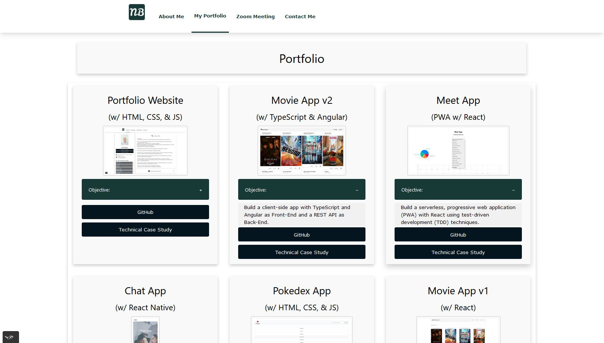
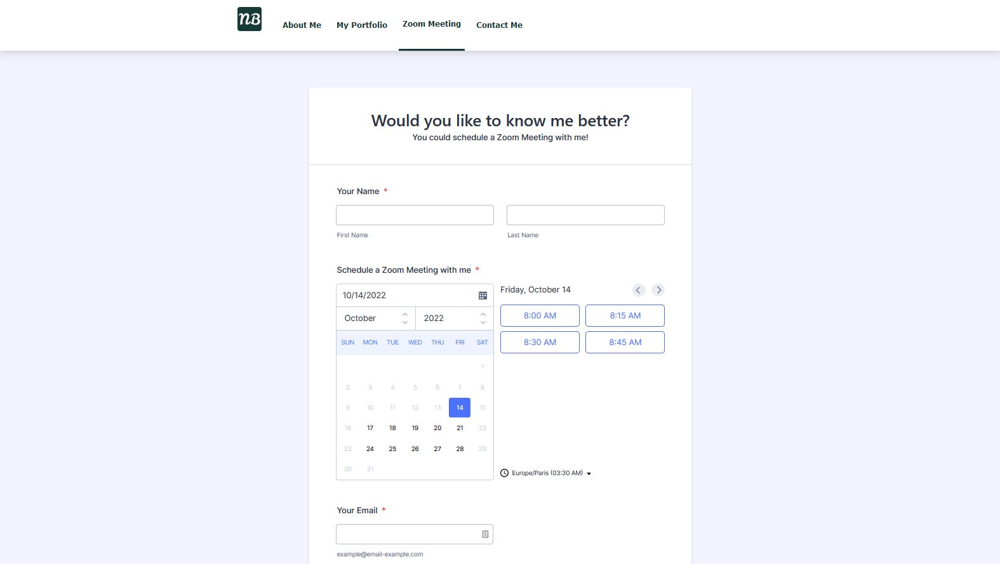
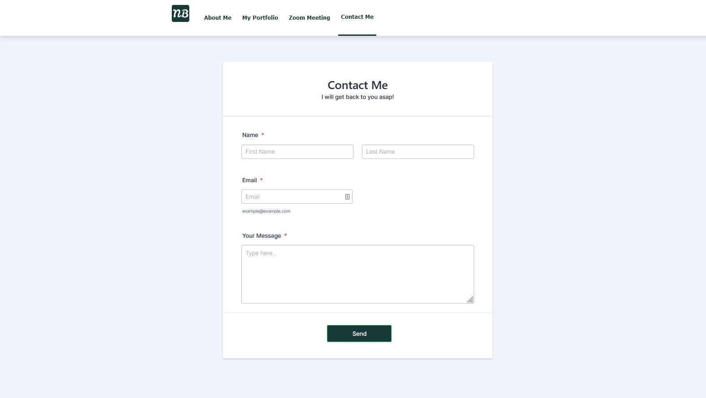

# Portfolio Website. Technical Case Study

## Objective

Build a portfolio website with HTML, CSS, and JavaScript to showcase my portfolio to my professional network and potential employers.

## Context

For a professional web developer is essential to have a designated place to present the work and demonstrate relevant skills such as problem-solving or practical knowledge in a programming language.

## Project Owner, Management, and Acknowledgement

[CareerFoundry](https://careerfoundry.com/) (25.02.2021 - 17.03.2022)

## Project Owner and improvements

Nick Balan (18.03.2022 - now)

## My Role

- Full-Stack Web Developer

## The 5 W's

- Who? — My professional network and potential employers. The website is for anyone interested in my professional work and who might want to contact me about it.
- What? — A responsive portfolio website built with HTML, CSS, and JavaScript.
- When? — The website might be visited when a potential employer checks out my previous experience or after I've met a professional contact. They would want to see what I'm up to nowadays.
- Where? — Potential employers might look at the website from their offices while networking contacts might access it from their mobile phones (e.g., after meeting me).
- Why? — For my potential employers, clients, or collaborators to learn more about my professional experience and relevant skills and how to reach me. The website will also demonstrate my HTML and CSS front-end development skills to employers.

## User Stories

As a user, I should be able to view the professional portfolio website and navigate between web pages on both mobile and desktop devices.

## Technical Requirements & Solutions

- The website must consist of at least three interconnected HTML pages
- The website must use at least one CSS file in which all styles are defined
- The website must use either CSS variables or a CSS preprocessor
- The website’s code must be hosted in a GitHub repository
- The website must be deployed on a server like GitHub Pages
- All the code must be valid
  - The HTML files must pass validation on the [Markup Validation Service](https://validator.w3.org/)
  - All colors used need to pass the [AA Accessibility Guidelines](https://contrastchecker.com/)
- The website must work on the latest Chrome, Firefox, Safari, Edge, and Opera browser versions, as well as on IE11
- The website must work on all screen sizes (including mobile and tablet) between 1920px and 320px in width
- The website must work with keyboard, mouse, and touch inputs.

## Technical Improvements & Solutions

### To Do:

- All pages must have an improved Mobile layout
- All pages must have an improved Mobile Navbar design.

### Done:

- All pages must have an improved desktop layout
- All pages must have a responsive Navigation Menu and a responsive Footer
- All pages must also use external CNDs
- All pages must have a Scroll To Top Button
- All pages must have a Responsive Mobile Navbar
- All pages must have a Modal Image Gallery.

## Key Features

- A landing page with a short introduction and links to work examples
- An about me page/section with crucial information about me as an individual, my relevant skills, and the tools or programming language(s) I used
- A portfolio page with my project examples in a grid
- A contact page and a contact section — in the footer of all pages.

## Live Demo

Check out the [Portfolio Website - Live page](https://nickbalan.github.io/portfolio-website/)

## Portfolio Website live screenshots

