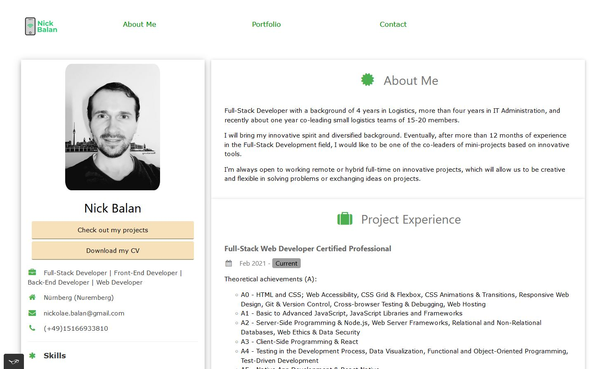
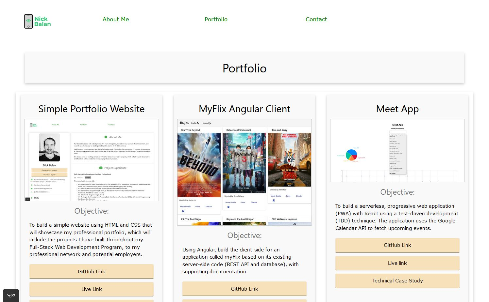
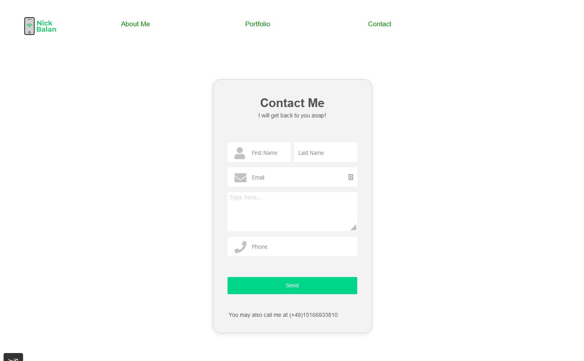

# Simple Portfolio Website. Technical Case Study

## Objective 
To build a simple responsive website using just HTML and CSS that showcases my professional portfolio, which will include the projects I've built throughout my Full-Stack Web Development Program, to my professional network and potential employers.

## Context
For a professional web developer is essential to have a designated place to present the work and demonstrate relevant skills such as problem-solving or practical knowledge in a programming language.

## Project Deliverables Acknowledgement
- CareerFoundry (25.02.2021 - 17.03.2022)

## Project Improvement Strategies
- Nick Balan (18.03.2022 - Current)

## My Role
- Full-Stack Web Developer

## The 5 W's
- Who? — My professional network and potential employers. The website is for anyone interested in my professional work and who might want to contact me about it.
- What? — A responsive portfolio website built just with HTML and CSS.
- When? — The website might be visited when a potential employer checks out my previous experience or after I've met a professional contact. They would want to see what I'm up to nowadays.
- Where? — Potential employers might look at the website from their offices while networking contacts might access it from their mobile phones (e.g., after meeting me).
- Why? — For my potential employers, clients, or collaborators to learn more about my professional experience and relevant skills and how to reach me. The website will also demonstrate my HTML and CSS front-end development skills to employers.

## User Stories 
As a user, I should be able to view the professional portfolio website and navigate between web pages on both mobile and desktop devices. 

## Technical Requirements & Solutions 
- The website must consist of at least three interconnected HTML pages 
- The website must use at least one CSS file in which all styles are defined 
- The website must use either CSS variables or a CSS preprocessor
- The website’s code must be hosted in a Git repository on GitHub
- The website must be deployed on a server like GitHub Pages
- All the code must be valid
  - The HTML files must pass validation on the [Markup Validation Service](https://validator.w3.org/) 
  - All colors used need to pass the [AA Accessibility Guidelines](https://contrastchecker.com/)
- The website must work on the latest Chrome, Firefox, Safari, Edge, and Opera browser versions as well as on IE11
- The website must work on all screen sizes (including mobile and tablet) between 1920px and 320px in width
- The website must work with keyboard, mouse, and touch inputs.

## Technical Improvements & Solutions 
- The portofolio page must use W3Schools CSS
- The homepage/landing/blog must use Tailwind CSS
- The homepage/landing/blog must use PostCSS

## Key Features 
- A homepage/landing/blog page with a short introduction and link(s) to work examples 
- An about me page/section with crucial information about me as an individual, my relevant skills, and the tools or programming language(s) I used 
- A portfolio page with my project examples in a grid 
- A contact section — as a section on each page in the footer and a contact page.

## Link to live hosted Simple Portfolio Website
Check out the [Simple Portfolio Website](https://nickbalan.github.io/portfolio-website/) page.

## Simple Portfolio Website screenshots

